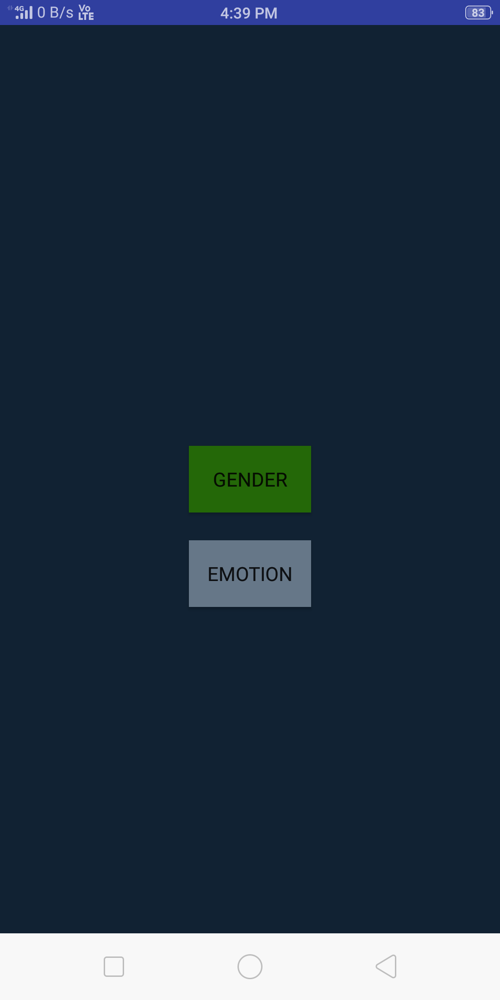

# DeepGenomotion

*DeepGenomotion is an android application that uses **deep learning** inspired augemented reality filters.*

*We use inference from our custom gender and emotion model to draw ar filter on real-time camera feed with inference rate of `25` to `100` ms for inference on single image.*

## Features
- Gender Model is a `MobileNet_V1_224_0.5` model trained on IMDB-WIKI celebrity face dataset.
- Emotion Model is a `MobileNet_V2_224_1.4` model trained on [AffectNet](http://mohammadmahoor.com/affectnet) Dataset containing 1m facial images and 11 classes of emotion
- Both model are trained using tensorflow and then the trained graph is converted into Tensorflow Lite for serving.
- We use MobileVision API for facial landmark detection.

## APP Home Screen

  

